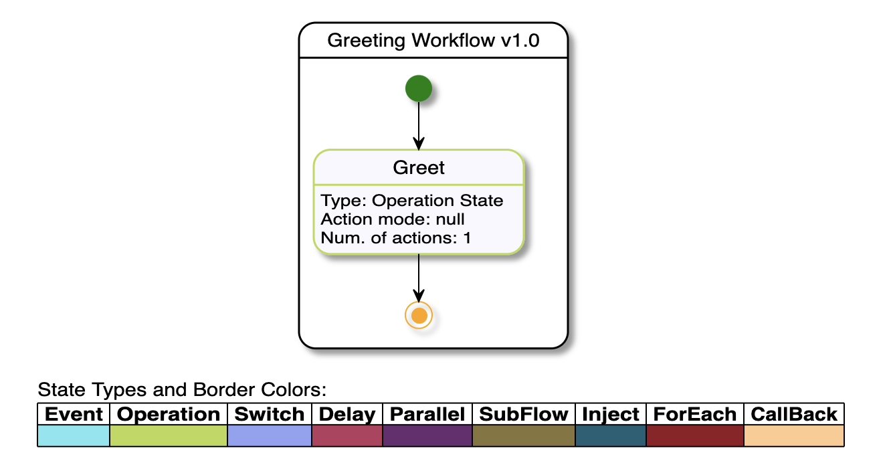

# Serverless Workflow Specification - Diagram Service

Provides a simple service for Serverless Workflow diagram generation. Based on [Quarkus](https://quarkus.io/).
Allows to generate SVG workflow diagrams from the JSON/YAML workflow DSL.

### Status

| Latest Version | Conformance to spec version |
| :---: | :---: |
| 1.0 | [v0.6](https://github.com/serverlessworkflow/specification/tree/0.6.x) |


### Getting Started

#### From DockerHub

```text
docker pull quay.io/serverlessworkflow/diagram-service:1.0
docker images
docker run -i -t IMAGE_ID
```

where `IMAGE_ID` is the id of the pulled image

#### Build and run locally (Dev Mode)

To build and run tests locally:

```text
https://github.com/serverlessworkflow/workflow-diagram-service.git
cd workflow-diagram-service
mvn clean install
```

To run the service on dev mode:

```text
mvn clean install quarkus:dev
```
#### Build and run locally (JVM Docker Image)

```text
https://github.com/serverlessworkflow/workflow-diagram-service.git
cd workflow-diagram-service
mvn package -Dquarkus.native.container-build=true
docker build -f src/main/docker/Dockerfile.jvm -t sw/diagram-service .
docker run -i --rm -p 8080:8080 sw/diagram-service
```

#### Generating Diagram SVG from DSL (JSON/YAML)

Let's say you have a simple workflow definition in a file called test.yaml:

```yaml
id: greeting
version: '1.0'
name: Greeting Workflow
description: Greet Someone
start: Greet
functions:
  - name: greetingFunction
    operation: file://myapis/greetingapis.json#greeting
states:
  - name: Greet
    type: operation
    actions:
      - functionRef:
          refName: greetingFunction
          arguments:
            name: "${ .person.name }"
        actionDataFilter:
          results: "${ .greeting }"
    end: true
```

We use [curl](https://curl.se/) command:

```text
curl -X POST --data-binary @test.yaml -H "Content-type: text/x-yaml" http://localhost:8080/swdiagram
```

You should get back the following SVG:

```svg
<?xml version="1.0" encoding="UTF-8" standalone="no"?><svg xmlns="http://www.w3.org/2000/svg" xmlns:xlink="http://www.w3.org/1999/xlink" contentScriptType="application/ecmascript" contentStyleType="text/css" height="333px" preserveAspectRatio="none" style="width:624px;height:333px;" version="1.1" viewBox="0 0 624 333" width="624px" zoomAndPan="magnify"><defs><filter height="300%" id="f9a2e4r" width="300%" x="-1" y="-1"><feGaussianBlur result="blurOut" stdDeviation="2.0"/><feColorMatrix in="blurOut" result="blurOut2" type="matrix" values="0 0 0 0 0 0 0 0 0 0 0 0 0 0 0 0 0 0 .4 0"/><feOffset dx="4.0" dy="4.0" in="blurOut2" result="blurOut3"/><feBlend in="SourceGraphic" in2="blurOut3" mode="normal"/></filter></defs><g><rect fill="#FFFFFF" filter="url(#f9a2e4r)" height="244.2969" rx="12.5" ry="12.5" style="stroke: #000000; stroke-width: 1.5;" width="201" x="209.5" y="8"/><rect fill="#FFFFFF" height="212" rx="12.5" ry="12.5" style="stroke: #FFFFFF; stroke-width: 1.0;" width="195" x="212.5" y="37.2969"/><line style="stroke: #000000; stroke-width: 1.5;" x1="209.5" x2="410.5" y1="34.2969" y2="34.2969"/><text fill="#000000" font-family="sans-serif" font-size="14" lengthAdjust="spacingAndGlyphs" textLength="159" x="230.5" y="25.9951">Greeting Workflow v1.0</text><rect fill="#F8F8FF" filter="url(#f9a2e4r)" height="78.2031" rx="12.5" ry="12.5" style="stroke: #BADA55; stroke-width: 1.5;" width="157" x="220.5" y="103.2969"/><line style="stroke: #BADA55; stroke-width: 1.5;" x1="220.5" x2="377.5" y1="129.5938" y2="129.5938"/><text fill="#000000" font-family="sans-serif" font-size="14" lengthAdjust="spacingAndGlyphs" textLength="39" x="279.5" y="121.292">Greet</text><text fill="#000000" font-family="sans-serif" font-size="12" lengthAdjust="spacingAndGlyphs" textLength="137" x="225.5" y="145.7324">Type: Operation State</text><text fill="#000000" font-family="sans-serif" font-size="12" lengthAdjust="spacingAndGlyphs" textLength="108" x="225.5" y="159.7012">Action mode: null</text><text fill="#000000" font-family="sans-serif" font-size="12" lengthAdjust="spacingAndGlyphs" textLength="114" x="225.5" y="173.6699">Num. of actions: 1</text><ellipse cx="299" cy="57.2969" fill="#008000" filter="url(#f9a2e4r)" rx="10" ry="10" style="stroke: none; stroke-width: 1.0;"/><ellipse cx="299" cy="227.2969" fill="none" filter="url(#f9a2e4r)" rx="10" ry="10" style="stroke: #FFA500; stroke-width: 1.0;"/><ellipse cx="299.5" cy="227.7969" fill="#FFA500" rx="6" ry="6" style="stroke: none; stroke-width: 1.0;"/><path d="M299,67.4969 C299,75.0369 299,86.2969 299,97.7669 " fill="none" style="stroke: #000000; stroke-width: 1.0;"/><polygon fill="#000000" points="299,103.0369,303,94.0369,299,98.0369,295,94.0369,299,103.0369" style="stroke: #000000; stroke-width: 1.0;"/><path d="M299,181.3969 C299,192.1969 299,203.3069 299,211.7769 " fill="none" style="stroke: #000000; stroke-width: 1.0;"/><polygon fill="#000000" points="299,217.1869,303,208.1869,299,212.1869,295,208.1869,299,217.1869" style="stroke: #000000; stroke-width: 1.0;"/><rect fill="#FFFFFF" height="62.8906" rx="5" ry="5" style="stroke: #FFFFFF; stroke-width: 1.0;" width="615" x="8" y="270"/><text fill="#000000" font-family="sans-serif" font-size="14" lengthAdjust="spacingAndGlyphs" textLength="216" x="14" y="287.9951">State Types and Border Colors:</text><text fill="#000000" font-family="sans-serif" font-size="14" font-weight="bold" lengthAdjust="spacingAndGlyphs" textLength="44" x="19" y="306.292">Event</text><text fill="#000000" font-family="sans-serif" font-size="14" font-weight="bold" lengthAdjust="spacingAndGlyphs" textLength="78" x="73" y="306.292">Operation</text><text fill="#000000" font-family="sans-serif" font-size="14" font-weight="bold" lengthAdjust="spacingAndGlyphs" textLength="53" x="161" y="306.292">Switch</text><text fill="#000000" font-family="sans-serif" font-size="14" font-weight="bold" lengthAdjust="spacingAndGlyphs" textLength="43" x="224" y="306.292">Delay</text><text fill="#000000" font-family="sans-serif" font-size="14" font-weight="bold" lengthAdjust="spacingAndGlyphs" textLength="57" x="277" y="306.292">Parallel</text><text fill="#000000" font-family="sans-serif" font-size="14" font-weight="bold" lengthAdjust="spacingAndGlyphs" textLength="67" x="344" y="306.292">SubFlow</text><text fill="#000000" font-family="sans-serif" font-size="14" font-weight="bold" lengthAdjust="spacingAndGlyphs" textLength="43" x="421" y="306.292">Inject</text><text fill="#000000" font-family="sans-serif" font-size="14" font-weight="bold" lengthAdjust="spacingAndGlyphs" textLength="63" x="474" y="306.292">ForEach</text><text fill="#000000" font-family="sans-serif" font-size="14" font-weight="bold" lengthAdjust="spacingAndGlyphs" textLength="65" x="547" y="306.292">CallBack</text><rect fill="#7FE5F0" height="16.2969" style="stroke: none; stroke-width: 1.0;" width="54" x="14" y="309.5938"/><text fill="#000000" font-family="sans-serif" font-size="14" lengthAdjust="spacingAndGlyphs" textLength="0" x="18" y="322.5889"/><rect fill="#BADA55" height="16.2969" style="stroke: none; stroke-width: 1.0;" width="88" x="68" y="309.5938"/><text fill="#000000" font-family="sans-serif" font-size="14" lengthAdjust="spacingAndGlyphs" textLength="0" x="72" y="322.5889"/><rect fill="#92A0F2" height="16.2969" style="stroke: none; stroke-width: 1.0;" width="63" x="156" y="309.5938"/><text fill="#000000" font-family="sans-serif" font-size="14" lengthAdjust="spacingAndGlyphs" textLength="0" x="160" y="322.5889"/><rect fill="#B83B5E" height="16.2969" style="stroke: none; stroke-width: 1.0;" width="53" x="219" y="309.5938"/><text fill="#000000" font-family="sans-serif" font-size="14" lengthAdjust="spacingAndGlyphs" textLength="0" x="223" y="322.5889"/><rect fill="#6A2C70" height="16.2969" style="stroke: none; stroke-width: 1.0;" width="67" x="272" y="309.5938"/><text fill="#000000" font-family="sans-serif" font-size="14" lengthAdjust="spacingAndGlyphs" textLength="0" x="276" y="322.5889"/><rect fill="#87753C" height="16.2969" style="stroke: none; stroke-width: 1.0;" width="77" x="339" y="309.5938"/><text fill="#000000" font-family="sans-serif" font-size="14" lengthAdjust="spacingAndGlyphs" textLength="0" x="343" y="322.5889"/><rect fill="#1E5F74" height="16.2969" style="stroke: none; stroke-width: 1.0;" width="53" x="416" y="309.5938"/><text fill="#000000" font-family="sans-serif" font-size="14" lengthAdjust="spacingAndGlyphs" textLength="0" x="420" y="322.5889"/><rect fill="#931A25" height="16.2969" style="stroke: none; stroke-width: 1.0;" width="73" x="469" y="309.5938"/><text fill="#000000" font-family="sans-serif" font-size="14" lengthAdjust="spacingAndGlyphs" textLength="0" x="473" y="322.5889"/><rect fill="#FFCB8E" height="16.2969" style="stroke: none; stroke-width: 1.0;" width="75" x="542" y="309.5938"/><text fill="#000000" font-family="sans-serif" font-size="14" lengthAdjust="spacingAndGlyphs" textLength="0" x="546" y="322.5889"/><line style="stroke: #000000; stroke-width: 1.0;" x1="14" x2="617" y1="293.2969" y2="293.2969"/><line style="stroke: #000000; stroke-width: 1.0;" x1="14" x2="617" y1="309.5938" y2="309.5938"/><line style="stroke: #000000; stroke-width: 1.0;" x1="14" x2="617" y1="325.8906" y2="325.8906"/><line style="stroke: #000000; stroke-width: 1.0;" x1="14" x2="14" y1="293.2969" y2="325.8906"/><line style="stroke: #000000; stroke-width: 1.0;" x1="68" x2="68" y1="293.2969" y2="325.8906"/><line style="stroke: #000000; stroke-width: 1.0;" x1="156" x2="156" y1="293.2969" y2="325.8906"/><line style="stroke: #000000; stroke-width: 1.0;" x1="219" x2="219" y1="293.2969" y2="325.8906"/><line style="stroke: #000000; stroke-width: 1.0;" x1="272" x2="272" y1="293.2969" y2="325.8906"/><line style="stroke: #000000; stroke-width: 1.0;" x1="339" x2="339" y1="293.2969" y2="325.8906"/><line style="stroke: #000000; stroke-width: 1.0;" x1="416" x2="416" y1="293.2969" y2="325.8906"/><line style="stroke: #000000; stroke-width: 1.0;" x1="469" x2="469" y1="293.2969" y2="325.8906"/><line style="stroke: #000000; stroke-width: 1.0;" x1="542" x2="542" y1="293.2969" y2="325.8906"/><line style="stroke: #000000; stroke-width: 1.0;" x1="617" x2="617" y1="293.2969" y2="325.8906"/></g></svg>
```

which gives us the following workflow diagram:

<p align="center">

</p>